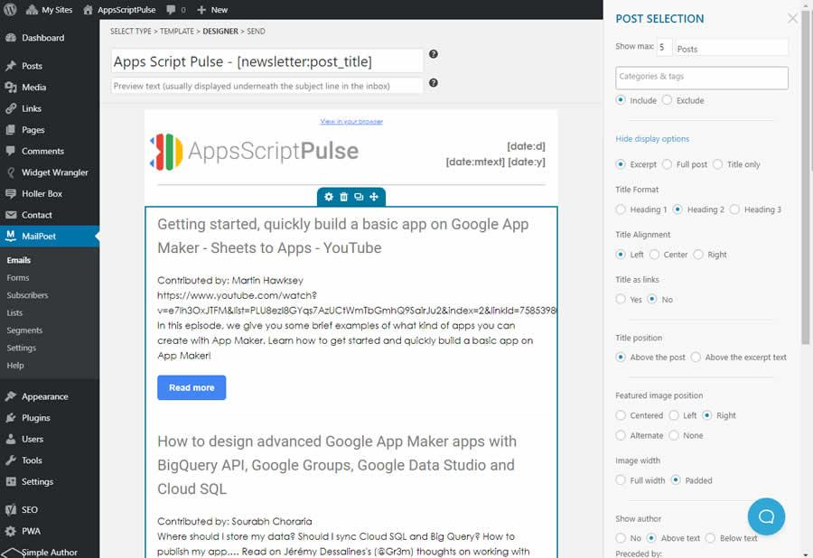
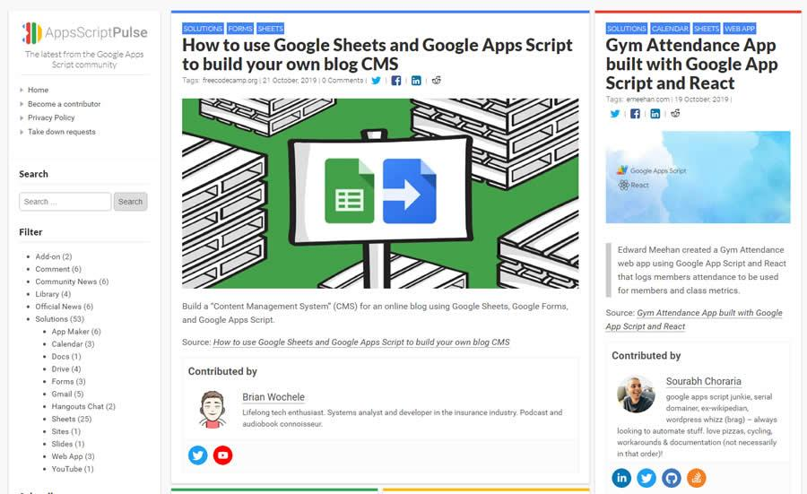
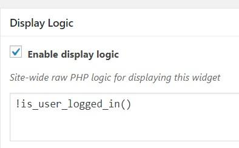

# Creating your own scoop.it-esque content curation community in WordPress

Recently I’ve been experimenting with a content curation site for the Google Apps Script community (see [Apps Script Pulse – Sharing Google Apps Script community content](https://mashe.hawksey.info/2019/09/apps-script-pulse-capturing-and-sharing-google-apps-script-community-content/)). In this post I want to share some of the things I learned setting this site up and resources I’ve created along the way.

The practice of collecting resources created by the Apps Script community was something I did for a number of years using the Scoop.it service and the [archive of this still exists](https://www.scoop.it/topic/gas). My collecting stopped in 2015 when scoop.it started making their service financial viable. In setting out to create my own curation site many of the design decisions I took were based on my scoop.it experience and trying to replicate some of it. 

One avenue I considered was going down the WordPress route with a SPLOT e.g. [TRU Collector](http://splot.ca/splots/tru-collector/) or [TRU Writer](http://splot.ca/splots/tru-writer/). I’m not entirely sure why I dismissed SPLOTing it and I’m sure Alan Levine will revoke my genius card as a consequence, but here’s the recipe I ended up with:

## Plugins

### [Contact Form 7](https://en-gb.wordpress.org/plugins/contact-form-7/)

> Just another contact form plugin. Simple but flexible.

Like it says on the tin - using this to collect details for those wanting to become a AppsScriptPulse Contributor.

### [Easy Add Thumbnail](https://en-gb.wordpress.org/plugins/easy-add-thumbnail/)

> Checks if you defined the featured image, and if not it sets the featured image to the first uploaded image into that post. So easy like that…

I’m currently recommending Pulse Contributors collect resources using ‘Press This’. As the ‘Press This’ interface doesn’t have an easy way to set a featured image this plugin gets around that problem (it also means that when Pulse Contributions are shared on Twitter a post image is included in the tweet.  

### [Fast Velocity Minify](https://en-gb.wordpress.org/plugins/fast-velocity-minify/)

> Improve your speed score on GTmetrix, Pingdom Tools and Google PageSpeed Insights by merging and minifying CSS and JavaScript files into groups, compressing HTML and other speed optimizations.

Currently my goto plugin for squishing CSS and JavaScript.

### [Holler Box](https://en-gb.wordpress.org/plugins/holler-box/)

> Sales and marketing automation for eCommerce stores. Lead generation and conversion popups and more.

Used for a non-intrusive popup to allow people to enter their email address for new post subscriptions.


### [Limit Login Attempts Reloaded](https://en-gb.wordpress.org/plugins/limit-login-attempts-reloaded/)

> Limit the rate of login attempts, including by way of cookies and for each IP address.

Given WordPress is often probed for malicious attempts to access it and the server it’s on some basic defense is handy.

### [MailPoet 3](https://en-gb.wordpress.org/plugins/mailpoet/)

> Create and send newsletters, post notifications and welcome emails from your WordPress.

I looked at a couple of email newsletter tools and this was by far the best. The basic version is free and you can get free premium access for up to 1,000 subscribers. This plugin has some lovely tools for composing emails, with various content blocks that can also be custom styled. Using MailPoet subscribers receive a summary of new posts, if there are any, on a daily basis. 



As emails are being sent from my webserver I spent some time setting up the domain to try and prevent emails from being detected as spam (to do this you need to add SPF, DKIM and DMARC records to your DNS - your web host might also be able to help). 

### [Members](https://en-gb.wordpress.org/plugins/members/)

> A user and role management plugin that puts you in full control of your site's permissions. This plugin allows you to edit your roles and their capabilities, clone existing roles, assign multiple roles per user, block post content, or even make your site completely private.

Using Members to give some more control over the built-in WordPress privileges and also for account approval.

### [Nextend Social Login](https://en-gb.wordpress.org/plugins/nextend-facebook-connect/)

> Nextend Social Login displays social login buttons for Facebook, Google and Twitter.

As this site is designed to support Google Apps Script users, having a Google account is a given so I’m using this plugin to enable sign in with a Google account (one less username/password for Contributors to remember).

### [Pending Submission Notification](https://en-gb.wordpress.org/plugins/pending-submission-notifications/)

> Send email notifications to the admin whenever a new article is submitted for review by a contributor

I was surprised that pending post email notifications to editors/admin wasn’t a built-in feature, hence using this plugin.

### [Press This](https://en-gb.wordpress.org/plugins/press-this/)

> A little tool that lets you grab bits of the web and create new posts with ease.

The main purpose of AppScriptPulse is to signpost community created content that is already published on the web. As a consequence the focus is capturing a nice picture, a couple of words about the content and a link to the source. If you’d like a better sense of the flow the [AppsScriptPulse Contributor Onboarding doc](https://docs.google.com/document/d/1pNfu9pfelMufnmpPSDV_wRwL8pgdgw8VWFgoYWq6qgE/edit) explains how ‘Press This’ can be added to your browser bookmarks so that when a Contributor finds a resource they can click a button and ‘Press This’ pre-populates the post with all the basic information.  

### [PWA for WP](https://en-gb.wordpress.org/plugins/pwa-for-wp/)

> We are bringing the power of the Progressive Web Apps to the WP & AMP to take the user experience to the next level!

Bit geeky but again useful for performance gains. I’m mainly using PWA for WP for additional caching options. PWA have other features including notifications but I haven’t gone there.

### [Simple Author Box](https://en-gb.wordpress.org/plugins/simple-author-box/)

> Adds a responsive author box with social icons on your posts.

Given AppsScriptPulse relies on the generosity of Contributors to source and share content it was important for me that those Contributors received the recognition they deserved. I also wanted to make it easy for people to make social connections. Simple Author Box makes it easy for a Contributor to provide a brief bio and include links to where they exist on the web. 



One limitation I found with this plugin was the contributor info box wasn’t displayed when you landed on the site homepage. Digging into the code I discovered this was because the display logic didn’t include display on the front page. To get around this I modified the filter in the theme functions.php.      

### [Widget Wrangler](https://en-gb.wordpress.org/plugins/widget-wrangler/)

> Widget Wrangler gives the WordPress admin a clean interface for managing widgets on a page by page basis. It also provides widgets as a post type, the ability to clone existing WordPress widgets, and granular control over widget templates.

This is a cool little plugin. As well as widget visibility each widget you create can be placed in any page or post using a shortcode. I’m currently using Widget Wrangler to control the display of the Nextend Social Login widget on the contributor signup page for only signed out users, made possible by using the option to control visibility with a php code snippet:



### [WordPress Zero Spam](https://en-gb.wordpress.org/plugins/zero-spam/)

> Tired of all the useless and bloated WordPress spam plugins? The WordPress Zero Spam plugin makes blocking spam a cinch. Just install, activate and say goodbye to spam. Based on work by David Walsh.

Another one of my goto plugins. A nice lightweight way to block spammers and also avoids additional privacy notices you would need to use if you were using options like Akismet.

### [Yoast SEO](https://en-gb.wordpress.org/plugins/wordpress-seo/)

> The first true all-in-one SEO solution for WordPress, including on-page content analysis, XML sitemaps and much more.

This one is a bit of a hammer to crack a nut. I originally installed Yoast as it was a quick way to make sure images in posts where added to a Twitter meta tag so that the Easy Add Thumbnail image is included with the link to the post when shared as a tweet. Having XML sitemaps and readability scores are a nice bonus...

## Theme

AppsScriptPulse is using [Carton](https://en-gb.wordpress.org/themes/carton/) as a base theme with some tweaking.

### Modifications

I made some tweaks to Carton as a child theme. I’ve put the child theme code, along with the onboarding doc and a fork of Simple Author Box into a [AppsScriptPulse repo](https://github.com/mhawksey/AppsScriptPulse/). 

The comments in [functions.php](https://github.com/mhawksey/AppsScriptPulse/blob/master/carton-child/functions.php) file highlight the main theme tweaks. Most of these are relatively minor, the biggest change was making a [custom RSS feed that included hashtags and Twitter screen names](https://pulse.appsscript.info/feed/twitter).The reason for making a modified feed was because new posts  are automatically posted to Twitter using the dlvr.it service (adding hashtags is an option in dlvr.it but this is part of their premium package). To added Twitter names for the resource author and post contributor a combination of post tags and Simple Author Box data was used:

```   // extract tags that start '@' and include in title as source twitter screenname
   $t = wp_get_post_tags($post->ID, array( 'fields' => 'names' ));
   foreach( $t as $item ) {
       if( strpos($item, "@") === 0 ) {
           $author = ' by '.$item;
       }
   }

   // If there is a Twitter handle provided in the Simple Author Box use as the contributor
   $a = get_user_meta($post->post_author, 'sabox_social_links', true );
   $tw = $a['twitter'];
   if ($tw){
	   $twitter = ' (contributed by @'.substr($tw, strrpos($tw, '/') + 1).')';
   }
   ```

## Summary

So there you have it - my take on a Scoop.it like self-hosted content curation site. I hope this post is useful and feel free to ping me if you have questions or suggestions for improvements I can make.

