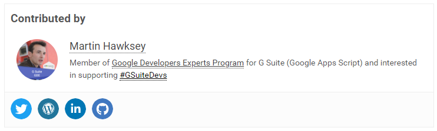
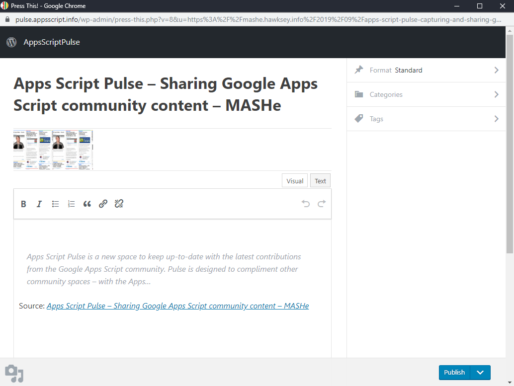
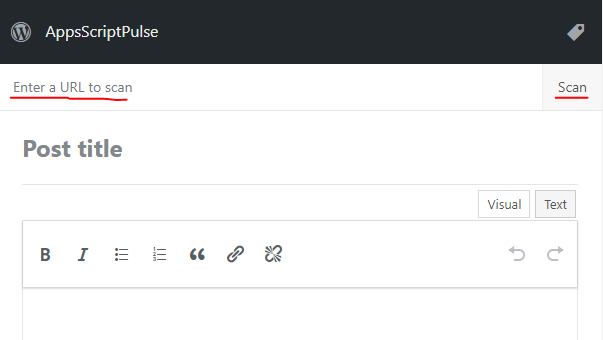
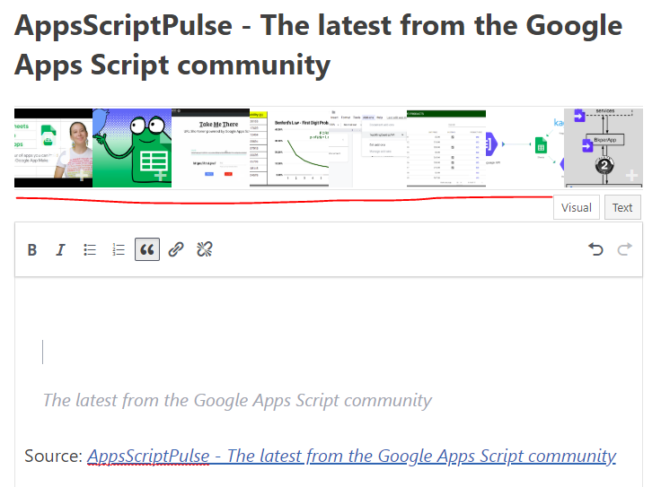
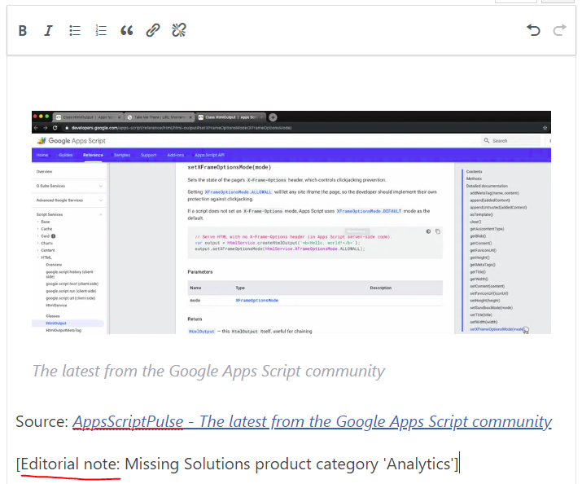

# Contributor Onboarding

Thank you for your interest in becoming an AppsScriptPulse Contributor. The AppsScriptPulse site is new development to support the Google Apps Script community. With your help we hope to showcase some of the best contributions and solutions developed by the community. This document is designed to help you get started as a contributor. If you encounter problems, have questions or would like to give feedback drop me a line at [m.hawksey@gmail.com](mailto:m.hawksey@gmail.com). Thank you again for your support!

Martin

Martin Hawksey
AppsScriptPulse Founder/GDE G Suite 

# OUR MISSION

As an AppsScriptPulse Contributor we are looking for you to find and share content to support the Google Apps Script community. **Content you contribute should reference Google Apps Script in some way**. The focus of the site is highlighting Google Apps Script news, tutorials and solutions. The site is not a replacement for existing community spaces such as the [Apps Script Stack Overflow](https://stackoverflow.com/questions/tagged/google-apps-script) site and the [Apps Script Google Group](https://groups.google.com/forum/#!forum/google-apps-script-community).

# HOW TO CONTRIBUTE  

AppsScriptPulse is built on a self-hosted WordPress blogging site. Even if you’ve already used WordPress there is still some guidance in this doc to make your life a little easier.

##  Logging in 

To contribute to the site and to update your profile you need to be logged in. To login visit: [https://pulse.appsscript.info/wp-login.php](https://pulse.appsscript.info/contributor-homepage/) - a ‘Continue with Google’ option is available to login to the site with your Google account.

##  Your Profile 

As a contributor to AppsScriptPulse all the posts you get published will include a ‘Contributed by’  box. You can update your profile bio, image and social media links by visiting **WP-Admin > Profile** (direct link: [https://pulse.appsscript.info/wp-admin/profile.php](https://pulse.appsscript.info/wp-admin/profile.php))

##  Sharing Content  

As a contributor to AppsScriptPulse our current workflow is you create draft content that will then be approved by one of our editors. This model will likely evolve over time and we welcome your feedback. Currently our focus is signposting existing content and we recommend you browse some of the [AppsScript](https://pulse.appsscript.info/)[Pulse](https://pulse.appsscript.info/)[ archive](https://pulse.appsscript.info/) to get a sense of the type or content we are looking for and the tone. There is no issue with sharing your own content and you are welcome to repost existing content you have written, or write a couple of lines and direct people to your original post. 

When proposing content for AppsScriptPulse please keep in mind that we'd like to avoid duplicate posts. Editors will check for duplicates and we understand that as not all content is immediately published there is a chance of duplication (this is an area we'll be monitoring and reviewing to see how we can improve).

##  ‘Press This’ Bookmarklet/Page     

To share existing community content, the recommended way to do this is using the ‘Press This’ page/bookmarklet. For more information on using ‘Press This’ you can visit **WP-Admin > Tools** (direct link: [https://pulse.appsscript.info/wp-admin/tools.php](https://pulse.appsscript.info/wp-admin/tools.php)).

When you find content you’d like added to AppsScriptPulse using the ‘Press This’ bookmarklet will open a screen where you can select images and edit the text of the contribution: 

If the ‘Press This’ bookmarklet doesn’t work for the page you are viewing or you want to add content using a mobile device you can use the ‘Press This’ direct link: [https://pulse.appsscript.info/wp-admin/press-this.php](https://pulse.appsscript.info/wp-admin/press-this.php) 

Opening the direct link allows you to enter the URL of the content you would like to share and click **Scan** which will detect any images and cite the source:

##  Images and Text  

Using ‘Press This’ will detect images from the scanned URL that you can include in your post. We recommend including at least one image in your post to make it look attractive. An image will be added at your cursor position by clicking on it from the ribbon:

Using ‘Press This’ will also include some quoted text from the URL source, which you can edit as needed, and a source link which should be kept. You can add your own text to the post as well to give the post context or your personal commentary.

##  Categories and Tags  

The ‘Press This’ editor allows you to set the post categories and tags. The available categories are being added to and if a category is missing you can leave a note in your post for our editors:

 

We currently use ‘Tags’ to identify the author of the post and these will be added by an editor. If you know the Twitter screen name of the author of the source content using a tag starting with ‘@’ followed by their Twitter screen name will attribute it to them in the automatic tweet sent from @AppsScriptInfo.  

# WHAT NEXT

Once your post has been approved it will automatically get tweeted from the @[AppScriptInfo](https://twitter.com/appsscriptinfo) Twitter account and be included in the next email digest of posts.

# HELP AND SUPPORT 

We’ve created a private [AppsScript](https://groups.google.com/forum/#!forum/appsscriptpulse-contributors)[Pulse](https://groups.google.com/forum/#!forum/appsscriptpulse-contributors)[ contributor Google Group](https://groups.google.com/forum/#!forum/appsscriptpulse-contributors) where you can ask/search for answers or if you prefer contact us at [pulse@appsscript.info](mailto:pulse@appsscript.info).  

# CURRENT CONTRIBUTORS

* Ivan Kutil

* Brian Bennett

* Brian Wochele

* Andrew Roberts

* Sourabh Choraria

* Jérémy Dessalines

* Martin Hawksey

##  Contributor Badges 

If you would like to display a badge showing you are a contributor there are a couple of options below:

<table>
  <tr>
    <td> 
Source: https://pulse.appsscript.info/files/2019/10/pulsecontributor-flat.png </td>
    <td> 
Source: https://pulse.appsscript.info/files/2019/10/pulsecontributor-icon.png </td>
  </tr>
</table>

 

This work is licensed under a

 [Creative Commons Attribution 4.0 License](http://creativecommons.org/licenses/by/4.0/).

